# idea-to-prod

A Claude Code plugin of lifecycle-pipeline skills that guide work from a raw
idea all the way to production. Each stage produces an artifact the next stage
consumes; the artifacts themselves are the pipeline state.

```mermaid
flowchart LR
    next{{"🧭 /next<br>the router"}} -. "reads artifact state,<br>hands off to the right stage" .-> idea

    idea("💡 /idea<br>idea.md") --> prd("📝 /prd<br>prd.md")
    prd --> ux("🎨 /ux-design<br>ux.md")
    ux --> architect("📐 /architect<br>architecture.md")
    prd -. "no UI surface" .-> architect
    architect --> decompose("🧩 /decompose<br>breakdown.md")
    decompose --> implement("⚙️ /implement<br>code + tests")
    implement --> verify("✅ /verify<br>verification.md")
    verify --> review("🔍 /review<br>review.md")
    review --> ship("🚀 /ship<br>release.md")
    ship --> operate("📡 /operate<br>retro.md")
    operate == "retro seeds<br>the next idea" ==> idea

    classDef stage fill:#dbeafe,stroke:#2563eb,color:#1e3a5f
    classDef conditional fill:#fef3c7,stroke:#d97706,color:#7c2d12,stroke-dasharray:5 4
    classDef router fill:#e9d5ff,stroke:#9333ea,color:#3b0764
    classDef closer fill:#dcfce7,stroke:#16a34a,color:#14532d

    class idea,prd,architect,decompose,implement,verify,review,ship stage
    class ux conditional
    class next router
    class operate closer
```



## Install

**Claude Code** (primary):

```
/plugin marketplace add mattbutlerengineering/skills
/plugin install idea-to-prod@skills
```

**oh-my-pi (omp):** the skills also run under [omp](https://omp.sh). The root
`package.json` declares them as a Pi package (`pi.skills`), so omp discovers all
of them once the repo is on its package path:

```
git clone https://github.com/mattbutlerengineering/skills
omp --skill ./skills/next          # or add the cloned dir as a Pi package
```

Fallbacks: omp inherits `.claude` skills on first run, or copy `skills/*` into
`~/.pi/agent/skills/`.

Every skill works on a bare install of either harness — no third-party tools,
MCP servers, or other plugins required.

That is the whole setup for the skills. To also stamp the factory into a repo
— offline gates, dispatch workflows, cost ledger — and confirm the install
works end to end, follow [`docs/setup.md`](docs/setup.md). `/doctor` checks it
mechanically, at whichever tier the repo has reached.

## Usage

Two ways in:

- **Guided:** invoke `/next` (Claude Code) or `/skill:next` (omp). It reads your
  repo's artifact state, tells you where the run stands, and hands off to the
  right stage skill.
- **Direct:** invoke any stage skill (`/prd`, `/architect`, … — `/skill:prd` on
  omp) to enter mid-stream. If a predecessor artifact is missing, the skill
  offers a quick backfill — it never blocks.

The pipeline runs at three scales: a **product run** (greenfield; artifacts
at your repo's `docs/` root), a **feature run** (artifacts under
`docs/features/<slug>/`, scaled down — a feature PRD is a page, not a book),
and a **maintenance run** (a defect, regression, refactor, or dependency
upgrade; artifacts under `docs/fixes/<slug>/`, entering at the capture step
and re-entering the pipeline at the depth recorded in its brief).

## Stages

| Skill | Stage artifact | Style |
|-------|----------------|-------|
| `next` | — (router) | reads state, routes |
| `idea` | `idea.md` | interviews you |
| `prd` | `prd.md` | interviews you |
| `ux-design` | `ux.md` (skipped if no UI surface) | interviews you |
| `architect` | `architecture.md` | drafts, then asks about trade-offs |
| `decompose` | `breakdown.md` | drafts |
| `implement` | code (+ checkboxes in `breakdown.md`) | test-first execution |
| `verify` | `verification.md` | drafts evidence |
| `review` | `review.md` | drafts findings |
| `ship` | `release.md` | checklist-driven |
| `operate` | `retro.md` | closes the loop → next idea |
| `capture` | `defect.md` (seeds a maintenance run) | interviews you |

Beside the stages, the plugin ships utility skills
([ADR-0023](docs/adr/0023-utility-skills.md)) that act on the work
surrounding the pipeline rather than a run's artifacts: `address-pr-review`
works reviewer feedback on a PR you authored — fix, push, reply, resolve,
and reconcile with the base branch. `autorun` drives a whole run end to end
from a one-time brief — one fresh subagent per stage, every brief gap logged
as an assumption, and, unless the brief explicitly authorizes the release,
it prepares the release and stops rather than executing it. `mermaid` turns a process or system
into a digestible mermaid diagram with explicit, contrast-safe colors that
read in both light and dark renderers. `factory-init` stamps a product repo
with the factory scaffold — offline gates, dispatch workflows, and the cost
ledger — so promoted work orders can run there unattended. `doctor` is the
read-only counterpart to that stamp: run in the repo that *uses* these
skills, it answers whether the install is actually wired up, tier by tier —
the plugin side in any repo, the stamped detectors and targets when the
factory is present, label drift only when asked — and reports each problem
with the fix rather than applying it. `work-queue` runs several
already-approved work orders at once — one worktree-isolated agent per
order, bounded by the factory's WIP cap and priced against the monthly cap
before anything is spent — and stops at merge-ready PRs, because the merge
is a human gate. `audit` is the way in when there is no run yet and no
defect named: it surveys the codebase read-only, reproduces every finding
before reporting it, and routes each one to a carrier that already exists —
a backlog seed, a maintenance run via `capture`, a feature run via `idea` —
rather than opening a parallel plan tree of its own. `deepen` asks the
narrower architectural question instead: where is the codebase **shallow**,
its interfaces nearly as costly to learn as the implementations behind them?
It confirms each candidate against real call sites rather than a feeling of
friction, presents the deepenings as a self-contained before/after report
outside the repo, and designs the chosen interface with you.

The shared rules (run discovery, orientation table, soft gating, frontmatter
conventions) live in [`docs/pipeline-protocol.md`](docs/pipeline-protocol.md).

## Development

- [`CONTEXT.md`](CONTEXT.md) — canonical vocabulary
- [`docs/adr/`](docs/adr/) — architecture decision records and their status
- [`LEDGER.md`](LEDGER.md) — per-skill maturity (draft / used-once / battle-tested)
- `python3 lint.py` — structural lint of the install, router, and eval surface (the `CHECKERS` tuple in [`lint.py`](lint.py) is the authoritative list); runs in CI on every push/PR
- `python3 -m unittest discover tests` — the full offline suite: pipeline protocol, eval seams, and the factory tools, all against fixture trees; runs in CI on every push/PR
- `python3 orientation.py <run-dir>` — CLI adapter over [`protocol.py`](protocol.py), the one implementation of the orientation table
- `python3 trigger_eval.py --record` — routing eval: which skill fires for each query in [`evals/routing.json`](evals/routing.json) (needs the `claude` CLI; costs real runs)
- [`docs/output-evals.md`](docs/output-evals.md) — on-demand output evals grading skill artifacts against expectations

## License

MIT, except `trigger_eval.py`, which is derived from Apache-2.0-licensed code
from the skill-creator plugin — see [`NOTICE`](NOTICE) and
[`licenses/Apache-2.0.txt`](licenses/Apache-2.0.txt).
