# idea-to-prod

A Claude Code plugin of lifecycle-pipeline skills that guide work from a raw
idea all the way to production. Each stage produces an artifact the next stage
consumes; the artifacts themselves are the pipeline state.

```mermaid
flowchart LR
    next{{"🧭 /next<br>the router"}} -. "reads artifact state,<br>hands off to the right stage" .-> idea

    idea("💡 /idea<br>idea.md") --> prd("📝 /prd<br>prd.md")
    prd --> ux("🎨 /ux-design<br>ux.md")
    ux --> architect("📐 /architect<br>architecture.md")
    prd -. "no UI surface" .-> architect
    architect --> decompose("🧩 /decompose<br>breakdown.md")
    decompose --> implement("⚙️ /implement<br>code + tests")
    implement --> verify("✅ /verify<br>verification.md")
    verify --> review("🔍 /review<br>review.md")
    review --> ship("🚀 /ship<br>release.md")
    ship --> operate("📡 /operate<br>retro.md")
    operate == "retro seeds<br>the next idea" ==> idea

    classDef stage fill:#dbeafe,stroke:#2563eb,color:#1e3a5f
    classDef conditional fill:#fef3c7,stroke:#d97706,color:#7c2d12,stroke-dasharray:5 4
    classDef router fill:#e9d5ff,stroke:#9333ea,color:#3b0764
    classDef closer fill:#dcfce7,stroke:#16a34a,color:#14532d

    class idea,prd,architect,decompose,implement,verify,review,ship stage
    class ux conditional
    class next router
    class operate closer
```



## Install

```
/plugin marketplace add mattbutlerengineering/skills
/plugin install idea-to-prod@skills
```

Every skill works on a bare Claude Code install — no third-party tools, MCP
servers, or other plugins required.

## Usage

Two ways in:

- **Guided:** invoke `/next`. It reads your repo's artifact state, tells you
  where the run stands, and hands off to the right stage skill.
- **Direct:** invoke any stage skill (`/prd`, `/architect`, …) to enter
  mid-stream. If a predecessor artifact is missing, the skill offers a quick
  backfill — it never blocks.

The pipeline runs at two scales: a **product run** (greenfield; artifacts at
your repo's `docs/` root) and a **feature run** (artifacts under
`docs/features/<slug>/`, scaled down — a feature PRD is a page, not a book).

## Stages

| Skill | Stage artifact | Style |
|-------|----------------|-------|
| `next` | — (router) | reads state, routes |
| `idea` | `idea.md` | interviews you |
| `prd` | `prd.md` | interviews you |
| `ux-design` | `ux.md` (skipped if no UI surface) | interviews you |
| `architect` | `architecture.md` | drafts, then asks about trade-offs |
| `decompose` | `breakdown.md` | drafts |
| `implement` | code (+ checkboxes in `breakdown.md`) | test-first execution |
| `verify` | `verification.md` | drafts evidence |
| `review` | `review.md` | drafts findings |
| `ship` | `release.md` | checklist-driven |
| `operate` | `retro.md` | closes the loop → next idea |

Beside the stages, the plugin ships utility skills
([ADR-0023](docs/adr/0023-utility-skills.md)) that act on the work
surrounding the pipeline rather than a run's artifacts: `address-pr-review`
works reviewer feedback on a PR you authored — fix, push, reply, resolve,
and reconcile with the base branch.

The shared rules (run discovery, orientation table, soft gating, frontmatter
conventions) live in [`docs/pipeline-protocol.md`](docs/pipeline-protocol.md).

## Development

- [`CONTEXT.md`](CONTEXT.md) — canonical vocabulary
- [`docs/adr/`](docs/adr/) — architecture decision records and their status
- [`LEDGER.md`](LEDGER.md) — per-skill maturity (draft / used-once / battle-tested)
- `python3 lint.py` — structural lint (manifest, frontmatter, templates, router refs); runs in CI on every push/PR
- `python3 -m unittest discover tests` — orientation decision table vs fixture docs trees; runs in CI on every push/PR
- `python3 orientation.py <run-dir>` — CLI adapter over [`protocol.py`](protocol.py), the one implementation of the orientation table
- `python3 trigger_eval.py --record` — routing eval: which skill fires for each query in [`evals/routing.json`](evals/routing.json) (needs the `claude` CLI; costs real runs)
- [`docs/output-evals.md`](docs/output-evals.md) — on-demand output evals grading skill artifacts against expectations

## License

MIT, except `trigger_eval.py`, which is derived from Apache-2.0-licensed code
from the skill-creator plugin — see [`NOTICE`](NOTICE) and
[`licenses/Apache-2.0.txt`](licenses/Apache-2.0.txt).
