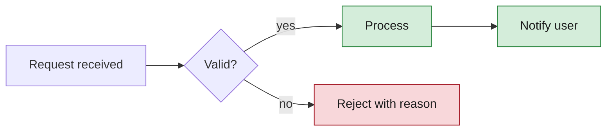
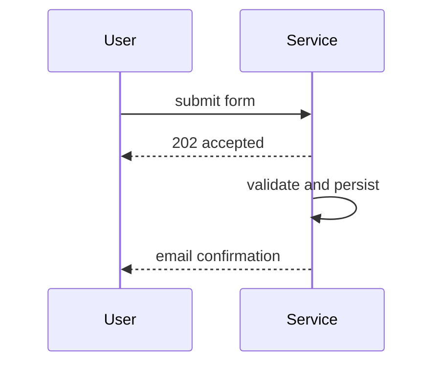

# Mermaid Diagrams

Produce mermaid diagrams that read at a glance: the right diagram type
for the content, few enough nodes to digest, and explicit colors whose
contrast survives both light and dark renderers.

## Process

1. **Pin down the one idea the diagram must convey.** If the content
   carries two ideas (say, a flow and a data model), plan two diagrams —
   split rather than crowd.

2. **Choose the type from the content**, not habit:
   - steps, decisions, branches → `flowchart`
   - actors exchanging messages over time → `sequenceDiagram`
   - the lifecycle of one thing → `stateDiagram-v2`
   - entities and their relations → `erDiagram`
   - types, fields, inheritance → `classDiagram`

3. **Draft small.** Aim for under ~15 nodes; when a flowchart grows past
   that, group related nodes into `subgraph`s or split the diagram. Keep
   node labels to 2–5 words; add edge labels only where they carry
   meaning the shape doesn't.

4. **Style with explicit `classDef`s — never the default theme.** Theme
   colors vary per renderer and can silently lose contrast. Every styled
   node gets an explicit `fill`, `stroke`, and `color` (text): dark text
   on a light fill or light text on a dark fill, at roughly WCAG AA
   contrast (4.5:1). Light tinted fills with dark text and a visible
   stroke stay legible on both light and dark page backgrounds.

5. **Never encode meaning by color alone.** Anything a color says (error
   path, deprecated state, external system) must also be said by the
   node's label or shape, so the diagram still reads in grayscale.

6. **Check against the list below**, and render the diagram if the
   environment has a renderer; otherwise re-read the source top to
   bottom as a reader would.

   - [ ] One idea; anything else split into its own diagram
   - [ ] Diagram type matches the content
   - [ ] Under ~15 nodes, subgraphed or split when larger
   - [ ] Labels short; edge labels only where they add meaning
   - [ ] Explicit fill, stroke, and text color on every styled node
   - [ ] Text-on-fill contrast ≈ 4.5:1 or better
   - [ ] No meaning carried by color alone
   - [ ] Legible on both light and dark backgrounds

## Examples

Flowchart with contrast-safe classDefs — the rejection reads from its
label, not just its red fill:

Sequence diagram — structure carries the meaning, so no styling needed:

## Rules

- One idea per diagram; several small diagrams beat one crowded one.
- Never rely on the default theme for color — explicit `fill`, `stroke`,
  and `color` on every styled node.
- Dark text on light fills or light text on dark fills, ~4.5:1 contrast.
- Never encode meaning by color alone — pair it with a label or shape.
- Diagram only what was asked for; a diagram nobody requested is noise,
  not documentation.
